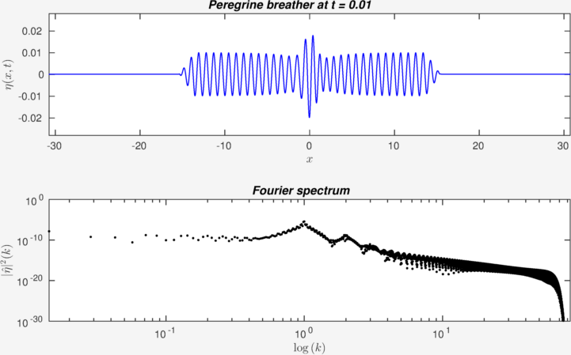

Full Euler solver on deep water
=======================

The present collection of [Matlab](http://mathworks.com/products/matlab/) scripts is a Fourier-type pseudo-spectral solver of the full Euler equations with the free surface on a fluid layer of infinite depth (the so-called *deep water approximation*). The time-dependent fluid domain is transformed into a strip using the conformal mapping technique (coined by L.V. Ovsyannikov for the first time in 1972 and developed later by A. Dyachenko *et al.* (1996)).

Time discretization is done using the embedded [Cash-Karp method](http://en.wikipedia.org/wiki/Cash%E2%80%93Karp_method) of the order 5(4). The time integration is improved using the integrating factor technique (*i.e.* exact integration of linear terms). The solver is initialized to simulate the celebrated Peregrine breather evolution in the full Euler. We refer to the following publication for more details on this solution:

* L. Shemer & L. Alperovich. *Peregrine breather revisited*. Phys. Fluids, **25**, 051701, 2013

Please, don't hesitate to contact the author with any questions, remarks and bug reports. The latest contact details can be found on this web page:

* [http://www.denys-dutykh.com](http://www.denys-dutykh.com/)

## Acknowledgements

The author would like to thank the following colleagues (in alphabetical order) who helped him to develop and initialize correctly the present solver:

* [Didier Clamond](http://math.unice.fr/~didierc/), [University of Nice Sophia Antipolis](http://unice.fr/), [Laboratoire J.A. Dieudonné](http://math.unice.fr/) France

* [Bernard Ee](https://www.researchgate.net/profile/Bernard_Ee2), [Tel Aviv University](http://english.tau.ac.il/), [School of Mechanical Engineering](http://engineering.tau.ac.il/), Israel

* [Lev Shemer](http://www.eng.tau.ac.il/~shemer/), [Tel Aviv University](http://english.tau.ac.il/), [School of Mechanical Engineering](http://engineering.tau.ac.il/), Israel